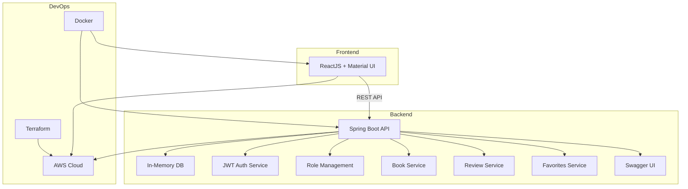

# Book Review Platform – High-Level Design Document

## 1. Overview
A web-based platform for book reviews, supporting user authentication, book/review CRUD, ratings, recommendations, search/filter, and profile management. MVP uses in-memory DB, JWT authentication, and is deployed on AWS using Docker and Terraform.

## 2. High-Level Component Diagram

## 3. Tech Stack
- **Frontend:** ReactJS, Material UI
- **Backend:** Java, Spring Boot
- **Database:** In-memory (H2/MapDB) for MVP
- **Authentication:** JWT (30 min expiry, extensible for refresh tokens)
- **API Documentation:** Swagger (publicly accessible)
- **Deployment:** Docker containers, Terraform scripts, AWS (ECS/EKS/S3/ALB as needed)

## 4. Non-Functional Requirements
- **Security:** JWT-based authentication, secret-protected admin API, XSS sanitization for reviews.
- **Scalability:** Stateless backend, containerized deployment, ready for DB migration.
- **Extensibility:** Role management via dedicated entity/table, modular service design.
- **Performance:** Pagination (20 items/page), efficient search/filter, sorting support.
- **Availability:** Deployed on AWS, separate services for frontend/backend.
- **Documentation:** Swagger UI for API docs.
- **Maintainability:** Clean codebase, separation of concerns, ready for future enhancements.

## 5. Key Design Decisions
- MVP uses in-memory DB; design allows migration to persistent DB.
- JWT tokens expire in 30 minutes; refresh token support planned for future.
- Admins created via secret-protected API; roles stored in DB.
- All fields validated for non-empty, min/max length; reviews sanitized for XSS.
- Deleted reviews immediately excluded from ratings.
- Favorites managed per user, no limit.
- Sorting and pagination metadata included in API responses.
- Public Swagger UI; AWS as cloud provider; Docker/Terraform for deployment.
